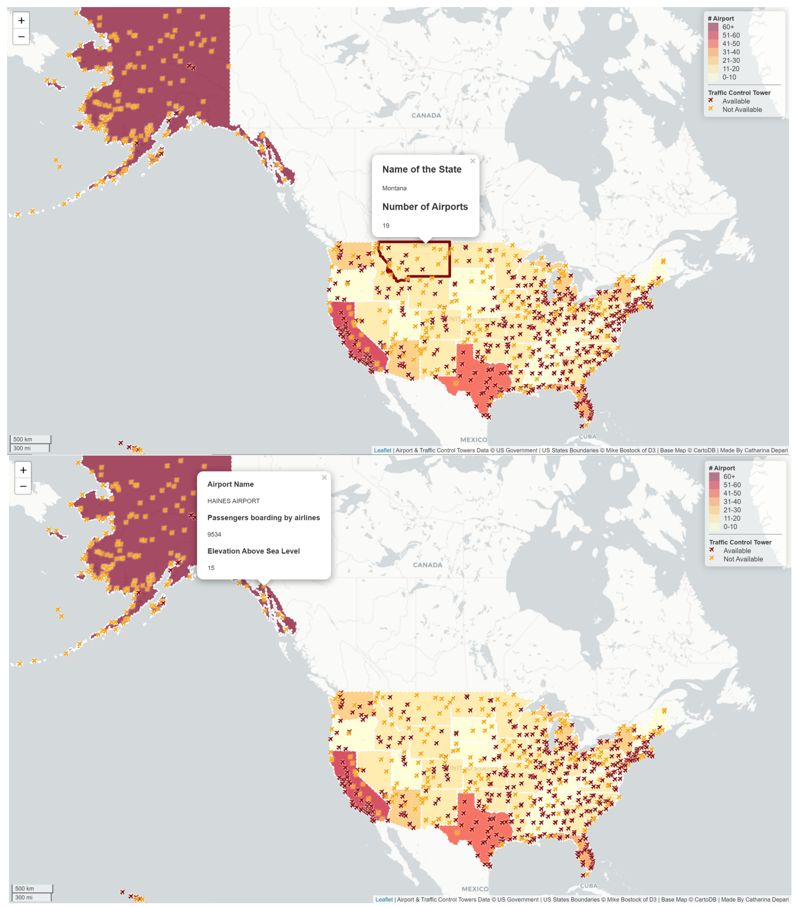

# catharinaleaflet

  
## Spatial Distribution of Airport's Traffic Control Tower in the U.S. 
### :newspaper: Introduction
The aim of this project is to visualize the spatial distribution of airport's traffic control tower in the U.S. Air traffic control tower or **`ATCTs`** are established at airports in order to provide for a safe, orderly, and expeditious flow of traffics on, and in the vicinity of, an airport **[1]**. In the U.S., the new control towers are part of the Federal Contract Tower Program and the criteria of establishing them are dependent upon the criteria set up by the Federal Aviation Administration (FAA) **[2]**. The controversy rises as there are no clear explanations about the criteria used by the FAA. However, **`the enplanned passengers (total enplanement)`** and **`elevation`** of airport platform are often mentioned as the criteria consistently used by FAA **[3]**. Given this background, this project would provide information about: *1) the distribution of the airport traffic control tower throughout the U.S.' airports,* and *2) the concentration of the airport traffic control tower on particular states in the U.S.*. 

### :hammer: Primary Functions
The primary functions used to create the spatial map are :
- **`var mymap = L.map()`** for initializing the map and set its view related to geographical coordinates and a zoom level.
- **`L.tileLayer()`** for defining the tile layer used for the basemap.
- **`var colors()`** for setting colors for differenciating 2 features of concerns: airports with ATCTs and those with no ATCTs.
- **`for (i = 0; i < 2; i++) {}`** for colorizing the markers
- **`L.geoJson.ajax()`** for linking the GeoJson dataset to the basemap
- **`onEachFeature: function (feature, layer)`** for assigning some functions on each parameter of the airport traffic control object in the dataset
- **`layer.bindPopup()`** for binding the required pop up method to the layer features of the dataset
- **`pointToLayer:function (feature, latlng)`** for assigning particular functions on each layer
- **`var id = 0; if (feature.properties.variable == "Y") { id = 0; } else if (feature.properties.variable == "N")  { id = 1; }`** for assigning conditional statements that is the airport with ATCTs or not based on the GeoJson dataset.
- **`function setColor(density) {}`** for defining the color ramp based on the density of each ATCTs
- **`function style(feature)`** for assigning` function that sets color property
- **`var legend = L.control({position:})`**` for creating leaflet control object for the legend
- **`legend.onAdd = function ()`** that runs when the legend is added to map.  

The new functions added to this leaflet project are associated with interactive elements retrieved from **`Leaflet Pluign`** which include:
- **`function onStateMouseOut(e){}`** for calling back when mouse exits a state polygon goes here, for additional actions.
- **`function onStateClick(e){}`** calling back for clicking inside a polygon from where users will find more details about each state (name of state and number of airports) and airport (the availability of ATCTs, name of the airport, elevation, and emplanement.
- **`function onStateHighlight(e)`** calling back for when a state is highlighted due to users' interests. 

## :books: Libraries
Below is the table that shows the data library of two geometric/spatial files used in this leaflet: **`airports.geojson`** and **`us-states.geojson`**.

| **data file**      | **attribute** | **type of data** | **description** |
| ------------------ | ------------- | --------- | --------------- |
| airports.geojson   | AIRPRTX010    | Numeric    | airport tax |
| | ICAO | String | four-letter alphanumeric code designating each airport around the world, determined by International Civil Avian Organization.|
| | IATA | String | International Air Transport Association, the official trade organization for the world's airlines|
| | AIRPT_NAME | String | name of the airport in the U.S.|
| | CITY | String | the city within which the airport is located|
| | STATE | String | the state within which the airport is located |
| | COUNTY | String | the county within which the airport is located|
| | TOT_ENP | Numeric | the total number of passengers enplanned by one aircraft |
| | ELEV | Numeric | the elevation level of the airport above the sea level |
| | CNTL_TWR | Binary | the avaiilability of ATCTs where *Y* indicates availability and *N* indicates the otherwise |
| us-states.geojson | id | Numeric| identification number of the airport according to FAA. |                         |
| | name | String | name of the State where the airport is located |
| | count | Numeric | number of airports had by the state |

There are 52 features contained in the **`us-state.geojson`** file and 940 features contained in the **`airports.geojson`** file.

## :mag_right: Data Resources
The two data files are obtained from two different sources as described below:
| Name of data file   | Data Format      | Description | Source |
| ------------------- | ----------------------- | ----------- | ------ |
| *airports.geojson*  | geojson/ geometric data | contains all the airports in the United States |<https://catalog.data.gov/dataset/usgs-small-scale-dataset-airports-of-the-united-states-201207-shapefile>|
| *us-states.geojson* | geojson/ geometric data | containing all the states' boundaries of the United States |https://bost.ocks.org/mike/|
| basemap | tile layer | a tile layer for the basemap | <http://leaflet-extras.github.io/leaflet-providers/preview/> |

## :bulb: Analysis
There are two interpretations that can be drawn from this spatial map where red icon represents the availability of ATCTs and yellow icon indicates the unavailability of ATCTs.
- ***First***, the distribution of airports with traffic control tower (ATCTs) is uneven throughout the U.S. When we relate the ATCTs distribution with elevation, the assumption does not hold true. Alaska state, for instance. Despite it is the largest state in the U.S. with the highest number of airports, the number of airports with ATCTs in this state is relatively low, compared to those in, say, Washington State whose area size is lower than Alaska. There are only 10 airports with ATCTs out of more than 60 airports in Alaska while there are 15 airports with ATCTs out of 24 airports in Washington State.
- ***Second***, the inconsistent conditions of the ATCTs in the U.S. shows the more complex considerations used by the FAA than what it may seem. For instance, Arizona State has an airport namely Sierra Vista Municipal Airport-Libby Army Airfield which has total passengers boarding of 968 and elevation of 4,662 m, and an ATCTs. While its other airport, the Show Low Regional Airport, has 3,080 passengers boarding and elevation of 6,415 m. This indicates that higher emplannement and elevation do not necessarily mean that the airport is more eligible to have a traffic control tower than another airport.  

## :flags: Credits/Acknowledgement
The credits for this project go to:
- Professor Bo Zhao, the instructor of the GEOG 458 A at the University of Washington for the teaching materials and knowledge sharing.
- United States Government for providing the data file through its open-sourced database.
- Mike Bostock whose website is inspirational for  further leaflet exercises and provides data file for this project.
- Carto DB for providing the basemap.
- Patiphan Phengpao whose stategy of developing live server for leaflet preview (besides Atom and Google Chrome) is highly contributive <https://www.youtube.com/watch?v=FHOcQdu1iFM>.  

### :link: References  
[1] Aviation consultant DWU:  <https://dwuconsulting.com/>  
[2] United States Department of Transportation: <https://www.faa.gov/news/fact_sheets/news_story.cfm?newsId=23616 >  
[3] Aircraft Owners and Pilots Association: <https://www.aopa.org/advocacy/advocacy-briefs/air-traffic-services-process-brief-criteria-for-establishing-air-traffic-control-towers-and-the-contract-tower-program>  
[4] Laflet Plugin <https://leafletjs.com/plugins.html>
